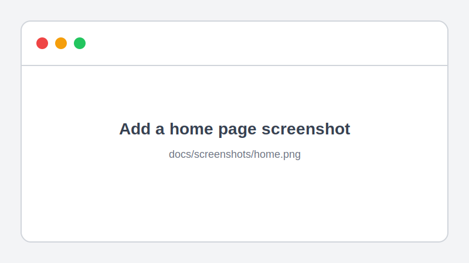
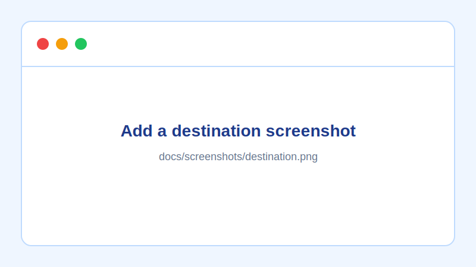

# Destinations

[](LICENSE)
[](https://github.com/basmalaallam/Travel-Website/commits/master)
[](https://ejs.co/)
[](https://getbootstrap.com/docs/4.3/getting-started/introduction/)

> A small, server-rendered travel discovery interface built with EJS templates and Bootstrap. It includes category browsing, destination detail views, search entry points, authentication forms, and a want-to-go list page.

## Preview

| Home | Destination detail |
| --- | --- |
|  |  |

The placeholders above are tracked so the README renders cleanly before screenshots are available. Replace them with real, consistently sized images at `docs/screenshots/home.png` and `docs/screenshots/destination.png`, then update the image paths in this README.

## Features

- Browse travel categories: hiking, cities, and islands.
- Explore destination-specific template pages.
- Use search, login, registration, and want-to-go list interfaces.
- Reuse the included image assets from a conventional Express/EJS `public/` directory.

## Project structure

```text
.
├── docs/
│   ├── screenshots/            # README screenshots and placeholders
│   └── PROJECT_STRUCTURE.md    # Integration and organization notes
├── public/                     # Images served as static assets
├── views/                      # EJS templates
├── .gitignore
├── LICENSE
└── README.md
```

## Getting started

This repository provides the EJS view and static-asset layer. It does **not** include an Express application entry point or `package.json`, so it must be used with an existing Node.js/Express host application.

1. Copy `views` and `public` into the corresponding directories in your Express project.
2. Configure the host app to use EJS and serve static files:

   ```js
   app.set('view engine', 'ejs');
   app.use(express.static('public'));
   ```

3. Add routes that render the templates and handle the form actions used by the views (such as `/search`, `/login`, and `/wanttogo`).
4. Start your host application using its documented command, then open its local URL in a browser.

See [project structure and integration notes](docs/PROJECT_STRUCTURE.md) for the expected template and asset conventions.

## Technology

- [EJS](https://ejs.co/) for server-rendered templates
- [Bootstrap 4](https://getbootstrap.com/docs/4.3/getting-started/introduction/) for UI components and responsive utilities
- HTML and CSS
- Node.js/Express-compatible project layout

## Documentation

- [Project structure and integration notes](docs/PROJECT_STRUCTURE.md)

## Contributing

Contributions are welcome. Please keep changes focused, preserve existing route and asset contracts unless intentionally versioned, and include screenshots for visible UI updates.

## License

Distributed under the [MIT License](LICENSE).
